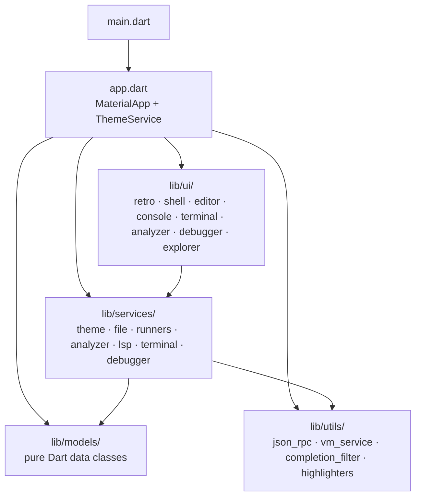
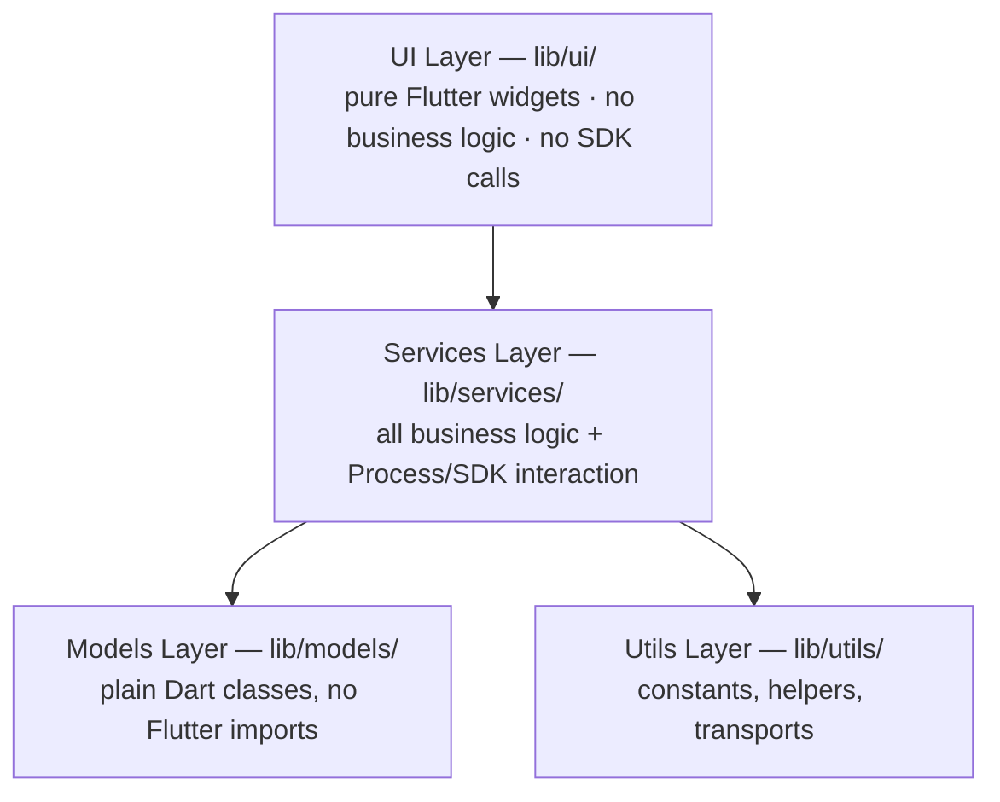
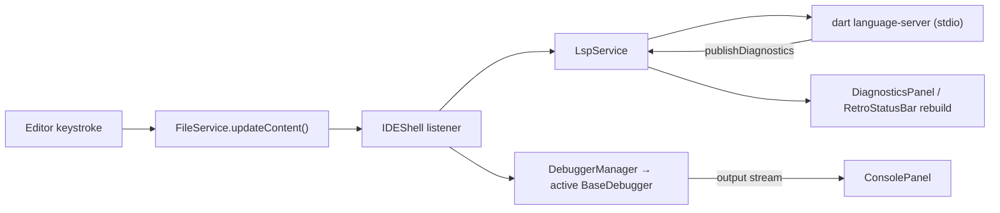

# 🖥️ Classic Code Editor

A retro-styled, multi-language IDE built with Flutter for macOS. Inspired by classic 90s IDEs like Borland C++, Visual C++ 6.0, and Delphi.

[](https://github.com/moradzadeh67/classic-code-editor/releases/latest)
[](https://opensource.org/licenses/MIT)
[](https://www.apple.com/macos/)
[](https://flutter.dev)

### 📥 [Download Latest Release](https://github.com/moradzadeh67/classic-code-editor/releases/latest)

## 💡 Why I Built This

I grew up fascinated by the golden age of IDEs — Borland C++, Visual C++ 6.0, Delphi. They had a **dense, functional, no-nonsense UI** that modern editors have lost in favor of rounded corners and minimalism.

I wanted to build a **real IDE** — not a toy — that:
- Runs natively on macOS (my daily driver)
- Supports multiple languages (Dart, Python, C, C++)
- Has **real LSP integration** for diagnostics and autocomplete
- Has a **real debugger** with breakpoints and variable inspection
- Brings back the **retro 3D UI** of the 90s

Classic Code Editor is my attempt at a **production-quality IDE** with a retro soul.

## 📸 Screenshots

> **Not committed yet.** Screenshot captures are not in the repository, so
> embedding them would render broken images. They are listed by their intended
> filenames instead — drop the `.png` files into `assets/screenshots/` to embed
> them again.

| Theme | Editor | Console | Debugger |
|-------|--------|---------|----------|
| **VC++ 6.0** | `assets/screenshots/vc6-editor.png` | `assets/screenshots/vc6-console.png` | `assets/screenshots/vc6-debugger.png` |
| **Borland Delphi** | `assets/screenshots/delphi-editor.png` | `assets/screenshots/delphi-console.png` | `assets/screenshots/delphi-debugger.png` |
| **Visual Basic 6.0** | `assets/screenshots/vb6-editor.png` | `assets/screenshots/vb6-console.png` | `assets/screenshots/vb6-debugger.png` |

## ✨ Features

### 🎨 Authentic Retro UI
- **3 Classic Themes:** VC++ 6.0 (gray), Borland Delphi (beige), Visual Basic 6.0
- **3D Raised/Sunken Borders:** Authentic Windows 95/98 look — no rounded corners
- **Theme Persistence:** Your theme choice is saved across restarts
- **Retro Panels:** Console, Terminal, Diagnostics, Debugger, Variables, Breakpoints

### ℹ️ Help & About
- **Help menu:** About, Keyboard Shortcuts, and System Info
- **About dialog:** three retro tabs — *About & Developer*, *Shortcuts*, and
  *System Info* (Flutter/Dart versions, active theme, platform)

### ⌨️ Smart Code Editor
- **Multi-Language Support:** Dart, Python, C, C++
- **Syntax Highlighting:** Per-language syntax colors, IntelliJ-style
- **Language Logos:** Real per-language icons in the panel header (with a
  vector fallback when an asset is missing)
- **Auto-Indentation:** Smart indentation on Enter, auto-dedent on closing brackets
- **LSP Integration:** Real-time diagnostics, hover tooltips, autocomplete
- **Offline Completion:** Falls back to a built-in per-language keyword/API list
  when the language server is unavailable
- **Breakpoint Gutter:** Click line number to toggle breakpoints
- **Tab Bar:** Multiple files with modified indicators

### 🐛 Real Multi-Language Debuggers
- **Debug Controls:** Debug, Stop, Step Over, Step Into, Step Out, Continue
- **Breakpoint Gutter:** Click a line number to set/unset a breakpoint; the
  paused line shows a `▶` marker drawn alongside the `●` bullet
- **Breakpoints Panel:** Set, remove, clear all breakpoints (auto-cleaned when
  the surrounding code is edited away)
- **Variables Panel:** Live variable inspection at the paused frame
- **Call Stack Panel:** Full call stack visualization
- **Per-language engines:** Dart drives a real **Dart VM Service** client
  (JSON-RPC over WebSocket — no extra package), Python runs a `sys.settrace`
  tracer, and C/C++ compile with `clang -g -O0` and attach **lldb**
- **Stops in *your* code:** every language installs an entry breakpoint in your
  `main`, so Debug pauses inside your file instead of VM or linker internals
- **Modular Architecture:** `BaseDebugger` interface + `DebuggerFactory`
  dispatch — the shell never learns which languages exist

### 🖥️ Integrated Terminal & Console
- **Terminal:** Full shell access with colored output
- **Console:** Live program output with color-coded lines
- **Debug Output Bridge:** Debugger banners, pauses and exit codes stream into
  the Console, so a session is never silent
- **Interactive Stdin:** Send input to running programs
- **Copy All / Copy Errors:** One-click clipboard export

### ⌨️ Keyboard Shortcuts
- `F5` — Run code
- `Cmd+S` — Save & auto-format
- `Cmd+N` — New file
- `Cmd+Z` / `Cmd+Y` — Undo / Redo
- `↑` / `↓` — Navigate autocomplete
- `Enter` — Accept autocomplete
- `Esc` — Dismiss autocomplete

## 🛠️ Tech Stack

- **Framework:** Flutter 3.x (macOS Desktop)
- **Language:** Dart 3.13.2+
- **Code Editor:** [`flutter_code_editor`](https://pub.dev/packages/flutter_code_editor)
- **Syntax Highlighting:** [`highlight`](https://pub.dev/packages/highlight)
- **File Picker:** [`file_picker`](https://pub.dev/packages/file_picker)
- **Path Handling:** [`path_provider`](https://pub.dev/packages/path_provider)
- **State Management:** Service-oriented + `ChangeNotifier`
- **LSP:** JSON-RPC over stdio via custom `JsonRpcClient`
- **Debugger:** Dart VM Service (JSON-RPC over WebSocket), Python `sys.settrace`, C/C++ `clang` + `lldb`
- **Architecture:** Layered (UI / Services / Models / Utils)

## ✅ Testing

The suite runs fully offline — no language server, compiler or VM is spawned.

```bash
# Static analysis must report zero issues
flutter analyze

# Unit + widget tests (106 tests; 1 opt-in integration test is skipped)
flutter test

# Opt-in: really spawn a Dart VM and attach over a real WebSocket
BORLAND_REAL_VM_TEST=1 flutter test test/integration/dart_vm_pause_test.dart
```

`DebuggerEnvironment` short-circuits every debugger while `FLUTTER_TEST` is set,
so the default `flutter test` run never launches `dart`, `python` or
`clang`/`lldb`. The opt-in test above flips that guard on for a single run so the
real attach/pause chain can be exercised. See [docs/DEBUGGING.md](docs/DEBUGGING.md)
for the full debugging architecture and troubleshooting guide.

## 🏗️ Architecture

Classic Code Editor follows a clean layered architecture with strict separation of concerns:

### Project Structure



### Architecture Layers



### Data Flow



### Layer Breakdown

```text
lib/
├── main.dart                        → Entry point
├── app.dart                         → MaterialApp + ThemeService
│
├── models/                          → Pure Dart data classes
│   ├── debugger_models.dart
│   ├── diagnostic.dart
│   ├── language_config.dart
│   ├── lsp_models.dart
│   └── tab_file.dart
│
├── services/                        → Business logic + SDK interaction
│   ├── analyzer_service.dart        → Static analysis (dart analyze)
│   ├── base_debugger.dart           → Abstract debugger (+ output stream, paused line)
│   ├── c_debugger.dart              → C/C++ debugger (clang + lldb)
│   ├── dart_debugger.dart           → Dart debugger (VM Service)
│   ├── dart_runner_service.dart     → Execute Dart code
│   ├── debug_service.dart           → Live variable watcher
│   ├── debugger_environment.dart    → Test seam (real-process gate)
│   ├── debugger_factory.dart        → Language → debugger dispatch
│   ├── debugger_manager.dart        → Active debugger follows the active tab
│   ├── debugger_snapshot.dart       → Shared stop-payload decoder
│   ├── file_service.dart            → Open/Save files
│   ├── language_runner_service.dart → Execute Python/C/C++
│   ├── lsp_service.dart             → Language Server Protocol
│   ├── python_debugger.dart         → Python debugger (sys.settrace tracer)
│   ├── terminal_service.dart        → Shell commands
│   └── theme_service.dart           → 3 themes + persistence
│
├── ui/                              → Pure Flutter widgets
│   ├── analyzer/                    → Diagnostics panel
│   ├── console/                     → Console output
│   ├── debugger/                    → Variables, call stack, breakpoints panels
│   ├── editor/                      → Code editor, tabs, autocomplete, hover
│   ├── explorer/                    → File explorer
│   ├── retro/                       → Retro design system (+ about dialog, logos)
│   ├── shell/                       → IDE shell (menu, toolbar, status)
│   └── terminal/                    → Integrated terminal
│
└── utils/                           → Helpers, constants
    ├── app_shortcuts.dart
    ├── completion_filter.dart
    ├── dart_highlighter.dart
    ├── json_rpc_client.dart
    ├── multi_language_highlighter.dart
    └── vm_service_client.dart
```

## 🎨 Retro Design System

### Themes

| Theme | Background | Panel | Editor BG |
|-------|:---:|:---:|:---:|
| **VC++ 6.0** | `#0055EA` (blue XP) | `#ECE9D8` | `#E8F1FF` |
| **Borland Delphi** | `#D2BA7E` (warm beige) | `#DFCD9B` | `#E8F1FF` |
| **Visual Basic 6.0** | `#2C4A8E` (dark blue) | `#C0C0C0` | `#E8F1FF` |

### Design Rules
- **NO rounded corners** (`BorderRadius.zero`) — internal widgets only
- **2px borders** for 3D raised/sunken effects
- **No gradients, no transparency**
- **Dense spacing** (4-8px padding)
- **Fonts:** Arial for UI, Menlo for code
- **Button height:** 22px (fixed)
- **Colors come from ThemeService** — never hardcoded

## 📱 Platform Support

| Platform | Status | Notes |
|---|:---:|---|
| 🖥️ macOS | ✅ Tested | macOS 12+ (Monterey or later) |
| 🪟 Windows | ❌ Not supported | Flutter desktop only |
| 🐧 Linux | ❌ Not supported | Flutter desktop only |

> **Note:** This app spawns external processes (`dart`, `python3`, `clang`, `lldb`). The macOS App Sandbox is **disabled** (`com.apple.security.app-sandbox = false`) to allow `Process.start`.

## 🚀 Installation

### Download Pre-built Release

1. Download the latest `.dmg` or `.zip` from [Releases](https://github.com/moradzadeh67/classic-code-editor/releases/latest)
2. Open the `.dmg` and drag `Classic Code Editor.app` to `Applications`
3. **First launch:** Right-click → Open (since the app is not notarized)

### Build from Source

```bash
# Clone
git clone https://github.com/moradzadeh67/classic-code-editor.git
cd classic-code-editor

# Install dependencies
flutter pub get

# Run
flutter run -d macos

# Build release
flutter build macos --release
```

### System Requirements

- macOS 12+ (Monterey or later)
- Dart SDK (for running Dart code)
- Python 3 (for running Python code)
- Clang (for running C/C++ code — comes with Xcode Command Line Tools)
- LLDB (for debugging C/C++ code — ships with the Xcode Command Line Tools)

## 🗺️ Roadmap

- ☑ Phase 01 — Project Skeleton
- ☑ Phase 02 — Retro UI Design System
- ☑ Phase 03 — IDE Shell
- ☑ Phase 04 — Code Editor
- ☑ Phase 05 — Dart Runner
- ☑ Phase 06 — Console
- ☑ Phase 07 — File Management
- ☑ Phase 08 — Tabs & Projects
- ☑ Phase 09 — Dart Analyzer (Static)
- ☑ Phase 10 — Dart LSP (Real-time)
- ☑ Phase 11 — IDE Intelligence (Autocomplete, Hover)
- ☑ Phase 12 — Terminal
- ☑ Phase 13 — Debugger
- ☑ Phase 14 — Multi-Language Support
- ☑ Phase 15 — Multi-Language Debugging
- ☑ Phase 16 — Debugger Hardening & Test Coverage
- □ Python LSP support
- □ C/C++ LSP support (clangd)
- □ On-device ML for code suggestions

See [ROADMAP.md](ROADMAP.md) for the canonical phase list and
[docs/PHASE_DETAILS.md](docs/PHASE_DETAILS.md) for per-phase scope.

## 🛠️ Technical Decisions

Every technical choice was made with simplicity, performance, and authenticity in mind:

- **Flutter Desktop for macOS:** The only way to get a native macOS app with a single Dart codebase.
- **Service-oriented architecture:** All business logic lives in `lib/services/`. UI widgets never call Process or the Dart SDK directly — they observe services via ChangeNotifier.
- **BaseDebugger + DebuggerFactory:** A single abstract debugger surface lets `DebuggerFactory` map a language to the right engine, so adding a language never touches the UI.
- **Hand-rolled Dart VM Service client:** The VM Service speaks JSON-RPC over a WebSocket; `VmServiceClient` wraps `dart:io`'s `WebSocket`, avoiding a new package while giving real breakpoints, stepping and call stacks.
- **LSP over JSON-RPC:** Connects to the official Dart language server via stdio, giving real diagnostics, autocomplete, and hover.
- **flutter_code_editor over custom:** Building a code editor from scratch is a project on its own — we layer syntax highlighting via `highlight`.
- **MacOS App Sandbox disabled:** Required because the app spawns external processes.
- **No rounded corners:** Authentic to the 90s aesthetic.

## 🤝 Contributing

Contributions are welcome! Please read [CONTRIBUTING.md](CONTRIBUTING.md) for guidelines on how to get started.

## 🙏 Credits & Attribution

- Flutter — Cross-platform UI framework
- flutter_code_editor — Code editing surface
- highlight — Syntax highlighting engine
- Dart Language Server — LSP for real-time diagnostics
- Dart VM Service — Real debugging protocol for Dart
- LLDB — Native debugger used for C/C++
- Visual C++ 6.0 — Original design inspiration
- Borland Delphi — Original design inspiration

## 📄 License

This project is licensed under the MIT License — see the [LICENSE](LICENSE) file for details.

Copyright © 2026 moradzadeh67
